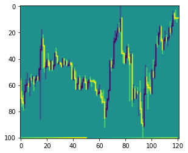

updated version of solving_ipda_with_dqn_2.

<h1>Solving the IPD-Algorithm using deep q learning</h1>

In this project i try to train a DQN to navigate through the forex market and be a profitable trading algorithm.
This is not the first project that tries to create a trading algorithm, but it is a very different approach from what is commonly used to do so.
Most attempts in RL based trading focus on daily candlesticks, many do not include brokerage fees.
They use some last 20 price bars and some indicators and try to squeeze it through an lstm expecting good results. 

So why is everyone talking about gpt models and image generation but all the trading models are not used anywhere after training?
It is because they do not work outside of the training data!

To create a NN that can trade the market, you have to know how the markets work. 
For learning about the market i recommend the free Youtube library of Michael J. Huddleston (aka ICT). 
<b>Everything in this Project is based on the research done by ICT!</b>

Here are just a few things that make trading NNs fail: 
<ol>
  <li> 20 bars say nearly nothing about future price movement</li> 
  <li> Price does not care about indicators</li>
  <li> With daily candlesticks there is not enough data to train a network without overfitting</li>
  <li> Higher timeframe movement is influenced by fundamentals and this is not included in candlestick based training</li>
  <li> Most developers do not know how the markets deliver price and as a result they do not know how to prepare candlestick data that a Neural Network can learn from it. A NN will not learn from a price vector of 20-40 bars scaled to -1 and 1 because it has no information that can be learned. 
</ol>
    

I will not remake the ICT mentorship in this but here are some main ideas about the market and how a NN can be used to learn it:
<ul>
  <li>Price is delivered by an algorithm, it is rule based and not random - <b>This can be learned by a neural network</b></li>
  <li>Intraday volatility is controlled to the Pip based on time and price</li>
  <li>A neural network should be able to determine the next draw on liquidity based on HTF charts and LTF charts and get fair value entries</li>
  <li>The input data for the neural network needs to have the information to solve #3 - for this it has to carry information about time and price</li>
  <li>The neural network needs to be able to process the input data in a way that it can extract the important information (so not use just rnn with a simple price vector)</li>
</ul>

  
<h3>How does this project implements the ideas listed above?</h3>
<h4> 1: The model input data </h4>
In this Project the DQN gets input data from multiple timeframes: m5, m15, h1, h4, d1 and its current position (1/-1 = long/short)
The number of candles that get pushed into the DQN is based on the IPDA-Data-ranges of 20days, 40days and 60days lookback + look-forward = 120 candlesticks.
This number is used on all timeframes. 
Candlestick data is encoded as a 2d array like the chart picture. Every candle is represented by 1 column in the picture and scaled down to a given max height of the picture (at time of writing this is set to 100). Every timeframe will be a picture of 120+1px width and 100+1px height. This height should be enough resolution to detect pd arrays. On lower resolution some pd arrays will not be visible and can not be used in the analysis by the model and will cause it to fail.  
A 101. row in the picture will carry information about time of day (because the algorithm is based on <b>time</b> and price.  A 121. column will have just one active unit that represents the current price to make the input processing less difficult  

<h4>Example of input image</h4>
the lowest row of the image represents time of day 
the last column of the image represents the current price (the same as the closing price of the last candle)

<h4>2: The model</h4>
The input images are filtered by a Conv2D with a filter size of 9x9 (time of writing) to detect basic pd arrays like highs/lows, rejection blocks, gaps or potential orderblocks. Currently 64 filters (time of writing) are used.  
The result will be a 101x121x64 image. The input image will be the channel 65 in the image. A Dense layer with 64 units is used to get the channels back to 64.  
Every timestep has a column of 101px and 64 channels. There are 121 timesteps. 
For every timestep the 101x64 data points are flattened to a single vector. The result is a data format of (batch_dim, timestep, features). 
After some dense layers to lower the features dimension this can be pushed into transformer encoders (Transformers are just good at everything and i wanted to do somethig with transformers). The transformer encoders can analyze the relationships between the pd arrays and time. This can verify or negate pd arrays and detect more pd arrays that a Conv2d can not detect like breaker blocks or mitigation blocks. With all this together the neural network can form a narrative of price and use it for further analysis. 
Because this is a DQN and not a generator we need a data format of (batch_dim, features) without a vector for every timestep. This is done by a simple GRU. 
After some dense layer post-processing the chart analysis is ready! A single vector of 256 units (time of writing) will carry all neccesary information about the chart, time, price and narrative.  

All charts will be processed by the same layers with the same weights because price is fractal and the imbalance of samples (5min vs 1D) would make the htf chart layers difficult to learn. This is why they all get the same weights. 
When every chart is processed, all the information (256 units for every chart) will be put together to a single large vector. Everything after this is dense layer processing until the output layer. 
The output layer has 2 neurons: first one for long, second for short.  
Notice, there is no output for do nothing/hold. This is because if there is a do nothing action, it would be the most used action and there would be very few training samples for other actions. This Model is long or short. But always has to prefer one of it!  
The actual model might differ from the description in number of layers / units per layer but it follows the logic of the description.

  
<h3>Main features of this project</h3>
<ul>
  <li>Brokerage fees are included in training (15/100000 - this is higher than a good broker offers)</li>
  <li>Calculations are done on the 5min timeframe for high number of training samples and more precision in trade execution (it is way more precise to enter a position on a 5min close than a daily close)</li>
  <li>training data is about 20 years on 15 currency pairs, 7/15 are USD pairs</li>
  <li>The NN has an awareness of time and Price</li>
  <li>The NN can detect and process PD-arrays</li>
  <li>The NN uses multiple timeframes (this is important, trust me! (or watch ICT))</li>
</ul>  

    
This project is still ongoing and has not yet yielded any significant results. 
I will clean up and comment the code sometime in the future 
tx_2: this configuration is currently trained on my laptop 
tx_1: second possible configuration in model / hyperparameters but currently not used. If i get my hands on the tpu research cloud, this is where the tpu will work on. Did not get a response yet from the trc team :( 
tx_3: some modification to allow a "no position" action
  
<h3>The DQNAgent</h3>
I tried many implementations of a dqn agent like in keras-rl or tf-agents but i did not get anything to work. 
So i created my own implementation of a dqn. This version supports: 
<li>multiple model inputs of different input shapes</li>
<li>training on a tf strategy for TPUs or multiple GPUs (use strategy_dqn file)</li>
<li>multiple environments will get batched together for the action selection process</li>
 
<h4>How to use DQNAgent class in your project?</h4>
you need to code an environment class with this structure:  

class environment: 
  &emsp;def __init__(self, ...): 
    &emsp;&emsp;... 
  &emsp;def reset(self, first_reset = False): 
    &emsp;&emsp;... 
    &emsp;&emsp;return [observation1, observation2...] 
   &emsp;def step(self, action): 
    &emsp;&emsp;... 
    &emsp;&emsp;return [observation1, observation2...], reward, done # (done = True/False) 
    
  
Important for this dqn: your environment has to return a list of observations for every model input! if your model has only 1 input, you have to return a list of 1 element! 

